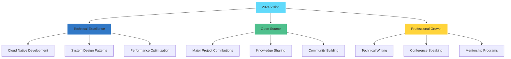

<div align="center">


[](https://git.io/typing-svg)

[](https://github.com/AerisWispX)

</div>

## 🌌 Digital Portfolio

```typescript
interface Developer {
    readonly name: string;
    title: string;
    location: string;
    contacts: Contact[];
    skills: Map<string, string[]>;
    currentFocus: string[];
    yearsOfExperience: number;
}

const AboutMe: Developer = {
    name: "Amal Kurian Tomy",
    title: "Full Stack Developer & Cloud Architect",
    location: "Kerala, India",
    contacts: [
        { platform: "LinkedIn", url: "linkedin.com/in/your-profile" },
        { platform: "Portfolio", url: "your-portfolio.com" },
        { platform: "Email", address: "your-email@example.com" }
    ],
    skills: new Map([
        ["languages", ["TypeScript", "Python", "Go", "Rust", "PHP", "Java"]],
        ["frontend", ["React", "Vue", "Svelte", "Next.js", "TailwindCSS"]],
        ["backend", ["Node.js", "Django", "Laravel", "Spring Boot"]],
        ["cloud", ["AWS", "GCP", "Azure", "Docker", "Kubernetes"]]
    ]),
    currentFocus: [
        "Microservices Architecture",
        "Cloud-Native Applications",
        "System Design",
        "Web3 Development"
    ],
    yearsOfExperience: 3
};
```

## 💫 Technology Arsenal

<div align="center">

### 🔥 Core Stack


### 🌐 Frontend Ecosystem


### ⚡ Backend & Infrastructure


### ☁️ Cloud Platforms


</div>

## 📊 Performance Metrics

<div align="center">


<p align="center">
  
  
</p>

[](https://github.com/AerisWispX)

[](https://github.com/ryo-ma/github-profile-trophy)

</div>

## 🎯 2024 Roadmap



## 🚀 Featured Projects

<div align="center">

[](https://github.com/AerisWispX/RealTimeChat)
[](https://github.com/AerisWispX/CloudArchitecture)

</div>

## 🤝 Professional Network

<div align="center">

[](https://linkedin.com/in/your-profile)
[](https://your-portfolio.com)
[](https://your-blog.com)
[](mailto:your-email@example.com)

### 💭 Engineering Philosophy
*"Crafting elegant solutions to complex problems, one line of code at a time."*

---


</div>
