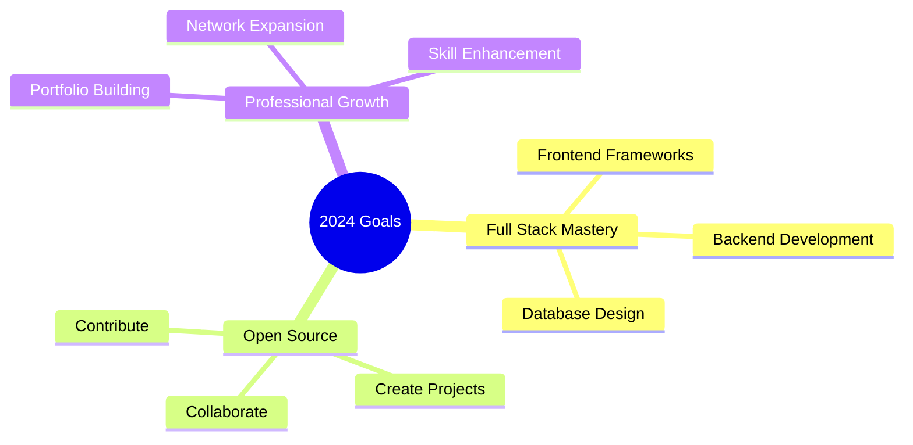

<div align="center">


[](https://git.io/typing-svg)

</div>

## 🌌 Welcome to My Digital Universe!

> *"In the realm of code, every bug is just an opportunity for a creative solution"*

```javascript
const AboutMe = {
    name: "Amal Kurian Tomy",
    title: "Full Stack Developer & BCA Graduate",
    location: "Kerala, India",
    currentStatus: "Building digital dreams, one commit at a time",
    interests: ["Web Development", "Software Architecture", "Problem Solving"],
    coffeeMeter: "☕☕☕☕",
    mode: "Always Learning 🚀"
};
```

## 💫 Tech Constellation

<div align="center">

### 🌟 Primary Technologies


### 🌍 Web Technologies


### 🛠️ Tools & Platforms


</div>

## 📊 GitHub Analytics

<div align="center">
  
[](https://github.com/AerisWispX)

[](https://github.com/AerisWispX)

[](https://github.com/AerisWispX)

</div>

## 🎯 Current Quests



## 🌟 Featured Projects

<div align="center">

[](https://github.com/AerisWispX/your-repo-name)

</div>

## 🤝 Let's Connect!

<div align="center">
  
[](https://linkedin.com/in/your-profile)
[](https://your-portfolio.com)
[](mailto:your-email@example.com)

</div>

<div align="center">

### 💭 Daily Mantra
*"Code is poetry written in logic"*

---


</div>
